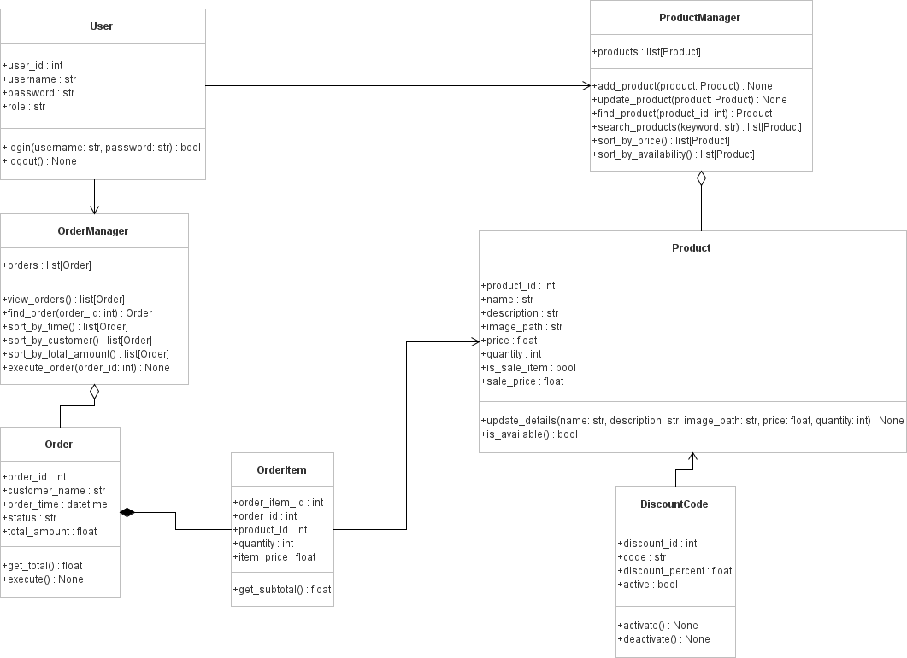

# UML Class Diagram

The class diagram below represents the main classes for the Online Grocery Internal Portal, including users, product management, inventory, discounts, orders, and order items.

Editable source file: [InternalGrocerySystemClassDiagram.class.violet.html](diagrams/InternalGrocerySystemClassDiagram.class.violet.html)
